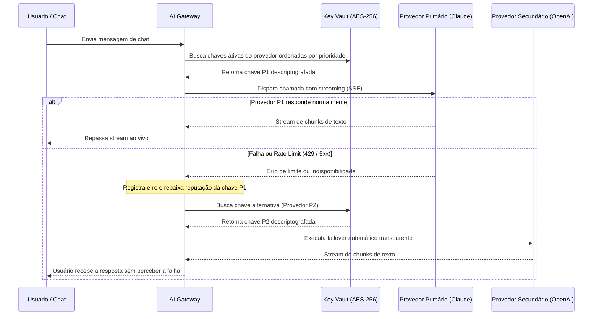
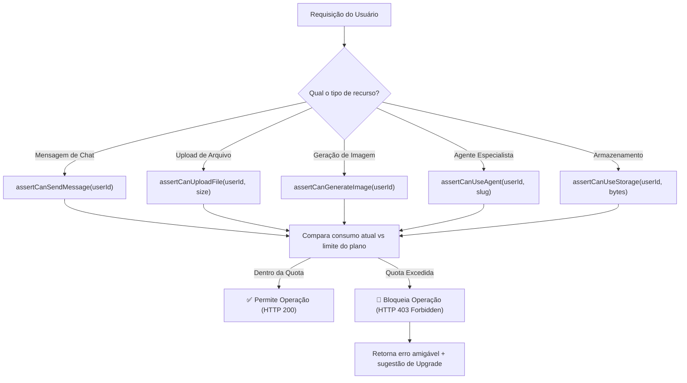
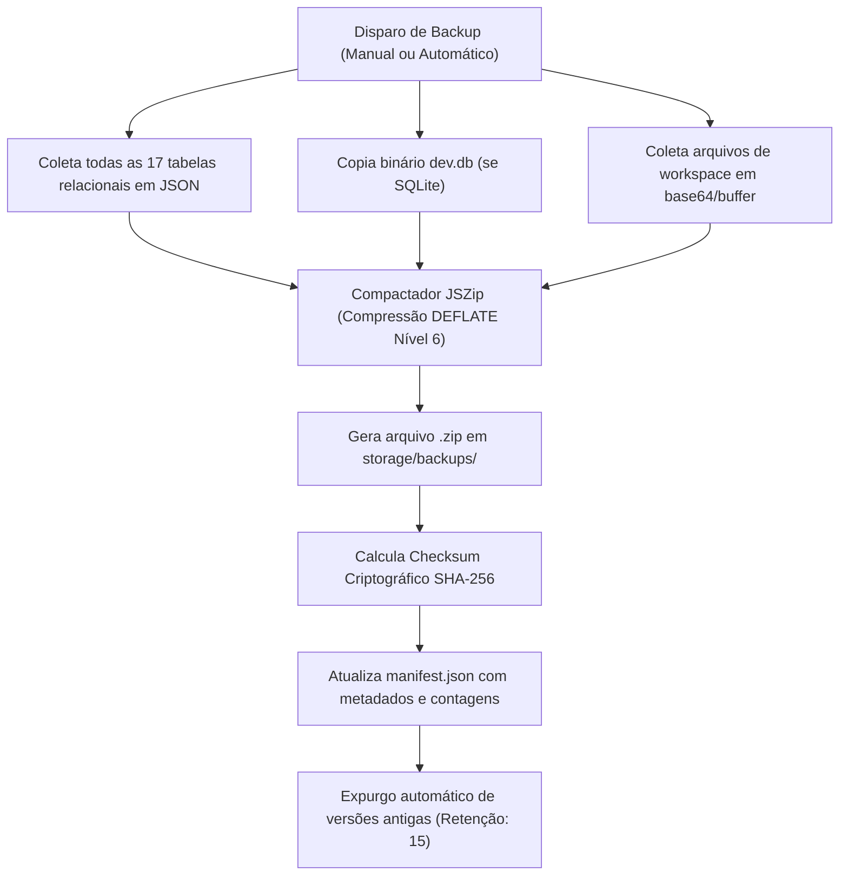

# ORVEXA PRIME DIGITAL — Documentação Técnica do Sistema

Este documento descreve detalhadamente a arquitetura de software, padrões de projeto, modelo de dados, mecanismos de segurança, fluxos de execução e especificações técnicas de cada subsistema que compõe a plataforma **ORVEXA PRIME SAAS**.

---

## 📑 Índice Geral

1. [Visão Geral & Padrões Arquiteturais](#1-visão-geral--padrões-arquiteturais)
2. [Estrutura Completa de Diretórios](#2-estrutura-completa-de-diretórios)
3. [Segurança, Criptografia & Zero Secrets](#3-segurança-criptografia--zero-secrets)
4. [AI Gateway Multi-IA & Algoritmo de Failover](#4-ai-gateway-multi-ia--algoritmo-de-failover)
5. [Smart Memory Engine & Busca Vetorial (pgvector)](#5-smart-memory-engine--busca-vetorial-pgvector)
6. [ORVEXA CODEX ENGINE](#6-orvexa-codex-engine)
7. [Motor de Consumo & Enforcement dos 5 Vetores](#7-motor-de-consumo--enforcement-dos-5-vetores)
8. [Camada Modular de Pagamentos](#8-camada-modular-de-pagamentos)
9. [Motor de Backup & Disaster Recovery](#9-motor-de-backup--disaster-recovery)
10. [Diagnóstico, Telemetria & Monitoramento](#10-diagnóstico-telemetria--monitoramento)
11. [Modelo de Dados Relacional (Prisma Schema Reference)](#11-modelo-de-dados-relacional-prisma-schema-reference)

---

## 1. Visão Geral & Padrões Arquiteturais

O **ORVEXA PRIME** foi desenvolvido utilizando **Next.js 14 com App Router**, **TypeScript estrito**, **Tailwind CSS** e **Prisma ORM**. A arquitetura foi estruturada para oferecer máxima resiliência, latência mínima e conformidade com padrões corporativos de segurança da informação (ISO/IEC 27001 e LGPD).

### Princípios Norteadores:
- **Clean Architecture:** Desacoplamento entre a camada de apresentação (React Server e Client Components), camada de aplicação (rotas de API), camada de domínio (motores de IA, consumo e regras de negócio) e camada de infraestrutura (banco de dados, gateways e provedores externos).
- **Zero Secrets no Frontend:** Nenhuma chave de API de terceiros, segredo de webhook ou chave de banco transita no código cliente. Todos os dados sensíveis são processados no Node.js Runtime.
- **Failover Atômico:** Garantia de que a falha de um provedor de IA ou chave individual nunca interrompe a experiência do usuário final.
- **Isolamento Multi-tenant Estrito:** Todas as operações de leitura e escrita filtram obrigatoriamente pelo `userId` autenticado na sessão.

---

## 2. Estrutura Completa de Diretórios

```text
orvexa-prime/
├── .env.example                     # Modelo documentado de variáveis de ambiente
├── package.json                     # Manifesto de dependências e scripts do projeto
├── tsconfig.json                    # Configuração estrita do compilador TypeScript
├── tailwind.config.ts               # Paleta de cores Obsidian Neon Luxury e animações
├── prisma/
│   ├── schema.prisma                # Definição das 17 entidades relacionais
│   ├── seed.js                      # Carga inicial de planos, modelos e agentes
│   └── dev.db                       # Banco de dados local SQLite (dev)
├── public/                          # Ativos estáticos e logotipos da plataforma
├── storage/
│   └── backups/                     # Diretório de retenção de snapshots e manifest.json
├── scripts/                         # Suíte de testes automatizados E2E
│   ├── build.js                     # Script otimizado de build com geração do Prisma
│   ├── run-all-system-tests.js      # CLI Runner do Diagnóstico Global do Sistema
│   ├── test-plans-and-consumption-e2e.js # Teste do motor de planos e 5 vetores
│   ├── test-backup-system-e2e.js    # Teste do motor de backup, SHA-256 e restore
│   ├── test-agents-architecture-e2e.js   # Teste estrutural dos 6 agentes
│   ├── test-smart-memory-e2e.js     # Teste da memória RAG e embeddings
│   ├── test-codex-engine-e2e.ts     # Teste da IDE Codex e execução
│   └── test-production-readiness-e2e.js  # Teste de PII, Rate Limiter e Logger
└── src/
    ├── middleware.ts                # Edge Guard (JWT validation, rotas /admin e /dashboard)
    ├── ai/                          # Motores especializados de Inteligência Artificial
    │   ├── agents/                  # Hub, ferramentas e dispatcher dos 6 especialistas
    │   ├── memory/                  # Indexador de arquivos, vetorizador e busca semântica
    │   └── tools/                   # Extratores de texto, analisadores AST e geradores
    ├── app/                         # Next.js 14 App Router
    │   ├── layout.tsx               # Layout raiz com ThemeProvider global
    │   ├── page.tsx                 # Landing Page corporativa do ORVEXA PRIME
    │   ├── (auth)/                  # Rotas de Login e Registro
    │   ├── admin/                   # Console Administrativo Executivo
    │   │   ├── page.tsx             # Dashboard geral de KPIs e faturamento
    │   │   ├── api-keys/            # Gestão ilimitada de chaves de API com rotação
    │   │   ├── agents/              # Monitoramento de agentes especialistas
    │   │   ├── audit/               # Visualizador de logs de auditoria imutáveis
    │   │   ├── backup/              # Console de Backup, Restauração e Download ZIP
    │   │   ├── router/              # Regras do ORVEXA PRIME ENGINE
    │   │   ├── settings/            # Configurações de modelos padrão
    │   │   ├── system/diagnostics/  # Bateria de testes e relatório de saúde
    │   │   ├── usage/               # Métricas agregadas de consumo da plataforma
    │   │   └── users/               # Gestão de usuários, status e bloqueios
    │   ├── dashboard/               # Portal do Cliente Autenticado
    │   │   ├── page.tsx             # Visão geral de consumo e ações rápidas
    │   │   ├── chat/                # Interface Multi-IA de Chat com streaming
    │   │   ├── codex/               # Ambiente IDE do ORVEXA CODEX ENGINE
    │   │   ├── billing/             # Gestão de Planos, 5 Vetores e Checkout
    │   │   ├── document-analyzer/   # Extração tabular e auditoria documental
    │   │   ├── image-studio/        # Estúdio de geração de imagens
    │   │   ├── memory/              # Painel de controle da Memória Inteligente
    │   │   ├── site-builder/        # Gerador comercial de sites para 7 segmentos
    │   │   └── workspace/           # Gerenciador de arquivos e índices RAG
    │   └── api/                     # Rotas de API HTTP (Serverless & Node.js Runtime)
    │       ├── admin/               # Endpoints restritos para administradores
    │       ├── ai/                  # Gateway de chat, agentes, codex, imagens e memória
    │       ├── auth/                # Login, registro, me e logout
    │       ├── billing/             # Checkout e upgrades de plano
    │       ├── webhooks/            # Webhooks de pagamento (Stripe / Mercado Pago)
    │       └── workspace/           # Upload, listagem e download de arquivos
    ├── components/                  # Biblioteca de componentes UI reutilizáveis
    └── lib/                         # Camada de serviços e infraestrutura do sistema
        ├── ai-gateway.ts            # Balanceador de carga, rotação de chaves e failover
        ├── audit.ts                 # Serviço estruturado de auditoria de segurança
        ├── auth.ts                  # Utilitários de sessão JWT e hashing com Bcrypt
        ├── backup.ts                # Motor de backup, validação SHA-256 e restore
        ├── cache.ts                 # Cache LRU em memória com métricas de hit rate
        ├── consumption.ts           # Motor de controle de consumo dos 5 vetores
        ├── crypto.ts                # Criptografia simétrica AES-256-GCM para chaves
        ├── diagnostics.ts           # Motor de telemetria, testes e cálculo de score
        ├── logger.ts                # Logger estruturado com buffer circular em memória
        ├── payment-gateway.ts       # Camada desacoplada para Stripe, Mercado Pago e Asaas
        ├── pii-masker.ts            # Sanitizador de dados pessoais (CPF, cartões, e-mails)
        ├── plan-limits.ts           # Definições de limites e modelos permitidos
        ├── prisma.ts                # Instância Singleton do PrismaClient
        └── rate-limit.ts            # Rate Limiter Sliding Window em memória
```

---

## 3. Segurança, Criptografia & Zero Secrets

### 3.1 Vault Criptográfico de Chaves de API (`src/lib/crypto.ts`)
As chaves de API dos provedores de IA são salvas no banco de dados exclusivamente na forma de texto cifrado utilizando o algoritmo **AES-256-GCM** (Galois/Counter Mode), que provê tanto confidencialidade quanto autenticação de integridade:
- **Chave Mestra (Key):** 256 bits derivados de `process.env.ENCRYPTION_KEY`.
- **Vetor de Inicialização (IV):** 12 bytes gerados criptograficamente de forma pseudo-aleatória (`crypto.randomBytes(12)`) para cada registro.
- **Tag de Autenticação (Auth Tag):** 16 bytes que impedem ataques de modificação de texto cifrado (*ciphertext tampering*).
- **Visualização Segura:** O banco armazena apenas um `keyHint` público (ex: `...x98a`), garantindo que administradores saibam qual chave está ativa sem expor o segredo original.

### 3.2 Autenticação & Sessões Baseadas em JWT (`src/lib/auth.ts`)
- Utiliza a biblioteca moderna e compatível com Edge Runtime **`jose`**.
- Tokens emitidos com algoritmo **HS256**, tempo de vida de 7 dias e armazenados em cookies HTTP com flags de proteção:
  - `HttpOnly = true` (inviolável contra scripts XSS no navegador).
  - `Secure = true` (em ambiente de produção, transmitido apenas via HTTPS).
  - `SameSite = lax` (proteção nativa contra requisições forjadas CSRF).
- Senhas são armazenadas utilizando **Bcrypt** com fator de custo (*salt rounds*) de 10.

### 3.3 Anonimização de Dados Pessoais — PII Masker (`src/lib/pii-masker.ts`)
Antes de registrar payloads em logs de auditoria ou no buffer de telemetria, o motor submete o conteúdo a expressões regulares de alta precisão que mascaram:
- **CPFs brasileiros:** `\d{3}\.\d{3}\.\d{3}-\d{2}` → `***.***.***-**`
- **Cartões de crédito:** Números de 13 a 19 dígitos passam por mascaramento preservando apenas os 4 últimos dígitos (`**** **** **** 1234`).
- **E-mails:** `usuario@dominio.com` → `u***@dominio.com`.
- **Senhas e Segredos:** Expressões contendo chaves como `password`, `token`, `secret` ou `authorization` são suprimidas.

### 3.4 Rate Limiter Sliding Window (`src/lib/rate-limit.ts`)
Proteção contra ataques de negação de serviço e abuso de requisições baseada em janela deslizante em memória (*Sliding Window Log*):
- `AUTH_LOGIN`: 5 tentativas por minuto por IP.
- `AUTH_REGISTER`: 3 cadastros por hora por IP.
- `AI_CHAT`: 30 requisições por minuto por usuário.
- `API_GENERAL`: 120 requisições por minuto por usuário.

---

## 4. AI Gateway Multi-IA & Algoritmo de Failover

O AI Gateway (`src/lib/ai-gateway.ts`) atua como uma malha inteligente que abstrai os provedores de IA:



### Regras de Descarte e Proteção de Chaves:
1. **Alerta a 90% de Cota:** Quando uma chave atinge 90% do seu limite mensal de tokens, seu status transita para `WARNING_90` e sua prioridade é rebaixada para que o balanceador priorize chaves mais folgadas.
2. **Quarentena Automática:** Se uma chave retornar erros consecutivos (ex: chave revogada ou inválida), o gateway a coloca em quarentena por 15 minutos, impedindo novas requisições até o término da janela.
3. **Bloqueio por Esgotamento:** Ao atingir 100% da cota, a chave é marcada como `BLOCKED_QUOTA` e excluída do rodízio ativo.

---

## 5. Smart Memory Engine & Busca Vetorial (pgvector)

O motor de memória (`src/ai/memory/`) implementa uma arquitetura completa de Recuperação Aumentada por Geração (**RAG**):

### 5.1 Fatiamento Semântico (`file-indexer.ts`)
Documentos enviados no workspace (PDF, DOCX, planilhas ou códigos-fonte) são divididos por blocos semânticos com as seguintes configurações padrão:
- **Tamanho do Chunk (`chunkSize`):** 350 a 500 caracteres, respeitando quebras naturais de parágrafo, pontuação e estruturas de funções.
- **Sobreposição Contextual (`overlap`):** 50 caracteres para preservar a continuidade de raciocínio entre blocos adjacentes.

### 5.2 Vetorização Densa de 384 Dimensões (`vector-store.ts`)
Cada fragmento textual é convertido em um vetor denso normalizado no espaço euclidiano:
- No ambiente local/desenvolvimento: utiliza cálculo vetorial normalizado em JavaScript com similaridade de cosseno ($S_C(A, B) = \frac{A \cdot B}{\|A\| \|B\|}$).
- No ambiente de produção com PostgreSQL: o campo `embedding` é persistido com tipo `vector(384)`, permitindo consultas indexadas em alta velocidade com operador de distância de cosseno:
  ```sql
  SELECT id, content, 1 - (embedding <=> $1) AS similarity
  FROM "FileKnowledge"
  WHERE "userId" = $2
  ORDER BY similarity DESC
  LIMIT 5;
  ```

---

## 6. ORVEXA CODEX ENGINE

O ambiente de programação profissional (`src/app/dashboard/codex/`) transforma o assistente de IA em um desenvolvedor parceiro (*pair programmer*):

### Recursos do Motor:
1. **Virtual Workspace Tree:** Estrutura em árvore de arquivos onde cada nó pode ser criado, renomeado, editado e excluído dinamicamente.
2. **Compilador e Analisador Sintático de Código:**
   - Suporte nativo: **JavaScript**, **TypeScript**, **Python**, **HTML**, **CSS**, **SQL** e **C#**.
   - Integração com rotas dedicadas de IA:
     - `/api/ai/codex/autofix`: Detecta inconsistências de tipagem, exceções não tratadas e variáveis não declaradas, gerando a versão corrigida com diff unificado.
     - `/api/ai/codex/explain`: Análise linha a linha com complexidade assintótica $O(n)$ e fluxo de execução.
     - `/api/ai/codex/review`: Auditoria de segurança verificando vulnerabilidades do OWASP Top 10.
3. **Exportador ZIP Instantâneo:** Utiliza a biblioteca `jszip` para gerar pacotes completos do projeto, estruturando os arquivos em árvore e disponibilizando o download direto em segundos.

---

## 7. Motor de Consumo & Enforcement dos 5 Vetores

A camada de monetização e controle de recursos (`src/lib/consumption.ts`) opera com monitoramento contínuo sobre **5 vetores de consumo**:



### Quotas Oficiais dos 4 Planos

| Vetor de Recurso | FREE | PRO | BUSINESS | ENTERPRISE |
| :--- | :--- | :--- | :--- | :--- |
| **Preço Base** | R$ 0,00 | R$ 79,90 | R$ 249,90 | R$ 799,90 |
| **1. Mensagens / Mês** | 100 | 1.500 | 6.000 | 50.000 (Ilimitado) |
| **2. Arquivos Processados** | 5 | 60 | 300 | 2.000 |
| **3. Geração de Imagens** | 10 | 80 | 300 | 1.500 |
| **4. Agentes Disponíveis** | `orvexa-dev` | Todos os 6 | Todos + Custom | Todos + Dedicados |
| **5. Armazenamento** | 100 MB | 5 GB | 25 GB | 100 GB |
| **Tokens Mensais** | 100.000 | 1.500.000 | 5.000.000 | 20.000.000 |

---

## 8. Camada Modular de Pagamentos

A camada de faturamento (`src/lib/payment-gateway.ts`) foi desacoplada de provedores específicos para permitir operação multigateway:

### Provedores Integrados:
1. **Stripe Provider:** Gerenciamento de sessões de checkout, assinaturas recorrentes com cartão de crédito internacional e validação de assinatura via cabeçalho `stripe-signature`.
2. **Mercado Pago Provider:** Geração dinâmica de Pix com payload Copia e Cola e QR Code em imagem SVG/PNG para liquidação imediata no Brasil.
3. **Asaas Provider:** Suporte a emissão de boletos bancários com código de barras e Pix corporativo.
4. **Sandbox Provider:** Ambiente de testes e homologação para validação de fluxos sem custos reais.

### Fluxo de Ativação via Webhook (`/api/webhooks/payment`):
- O webhook recebe o evento financeiro assinado com HMAC SHA-256.
- Validação de idempotência: se o `transactionId` já tiver sido liquidado, o webhook retorna confirmação sem duplicar registros.
- O status do usuário transita de `PENDING_PAYMENT` para `ACTIVE`.
- O período de vigência da `Subscription` é estendido por +1 mês.
- Um registro em `Payment` é criado com o recibo oficial.
- Um registro em `AuditLog` é gravado para fins de conformidade contábil.

---

## 9. Motor de Backup & Disaster Recovery

O sistema de backup (`src/lib/backup.ts`) foi projetado para tolerância a falhas catastróficas:



### Procedimento de Restauração com Snapshot Preventivo:
1. Ao acionar a restauração de um backup histórico, o motor recalcula o hash SHA-256 do arquivo no disco e valida contra o manifesto. Se houver divergência de 1 bit sequer, a restauração é abortada.
2. Antes de sobrescrever qualquer dado, o sistema gera automaticamente um **snapshot preventivo de segurança** (`safety-pre-restore-snapshot`).
3. Os dados são restaurados na ordem estrita de dependência relacional (`Plan` → `User` → `SystemSetting` → `ApiKey` → `Conversation` → `Message` → `File` → `UserMemory`).

---

## 10. Diagnóstico, Telemetria & Monitoramento

O motor de diagnóstico (`src/lib/diagnostics.ts`) provê observabilidade contínua da infraestrutura:

### Métricas Coletadas:
- **Consumo de Memória do Processo:** Heap Used, Heap Total, External e RSS em Megabytes.
- **Tempo Ativo (Uptime):** Segundos de operação contínua do processo Node.js.
- **Taxa de Acerto de Cache (Cache Hit Rate):** Eficiência do cache em memória medindo hits vs misses.
- **Latência Média de Queries:** Tempo de resposta do banco de dados ao executar consultas concorrentes em todas as tabelas centrais.
- **Status dos 5 Endpoints Críticos:** Verificação contínua das rotas de Chat, Agentes, Workspace, Telemetria e Rate Limiter.
- **Cálculo de Health Score (0 a 100%):** Algoritmo que pondera a taxa de aprovação dos testes de unidade e integrações, categorizando a saúde do SaaS em:
  - `EXCELENTE` (Score = 100% e 0 falhas)
  - `ESTÁVEL` (Score $\ge 80$% sem falhas críticas)
  - `DEGRADADO` (1 falha identificada)
  - `CRÍTICO` ($\ge 2$ falhas no sistema)

---

## 11. Modelo de Dados Relacional (Prisma Schema Reference)

O schema do banco de dados foi estruturado com foco em integridade e suporte a pgvector:

| Tabela / Modelo | Finalidade Principal | Índices de Performance |
| :--- | :--- | :--- |
| `User` | Usuários, autenticação, papel RBAC e status financeiro | `email`, `status`, `role` |
| `Plan` | Planos comerciais, preços e limites dos 5 vetores | `slug` (único) |
| `Subscription` | Assinaturas ativas, ciclos mensais e gateway provedor | `userId`, `status` |
| `Payment` | Transações financeiras, idempotência e comprovantes | `userId`, `status`, `transactionId` |
| `AiProvider` | Provedores cadastrados (Anthropic, OpenAI, Google) | `slug` (único) |
| `AiModel` | Modelos de IA e custos por 1k tokens de entrada/saída | `providerId`, `category`, `modelIdentifier` |
| `ApiKey` | Vault de chaves de API criptografadas com AES-256-GCM | `providerId`, `status`, `priority` |
| `Agent` | Definição dos 6 especialistas oficiais e ferramentas | `category`, `isActive`, `isSystem`, `slug` |
| `AgentMemory` | Memória semântica específica de cada agente | `agentId, userId`, `key` |
| `Conversation` | Sessões de chat do usuário com telemetria | `userId`, `createdAt` |
| `Message` | Mensagens trocadas, contagem de tokens e custo apurado | `conversationId`, `createdAt` |
| `File` | Arquivos enviados no workspace e dados estruturados | `userId`, `conversationId`, `category` |
| `FileKnowledge` | Chunks semânticos para RAG com vetores densos | `userId`, `fileId`, `category` |
| `UserMemory` | Memória inteligente de longo prazo do usuário | `userId`, `category`, `key` |
| `ConversationMemory` | Resumos executivos de discussões anteriores | `userId`, `conversationId` |
| `GeneratedImage` | Histórico e metadados de imagens geradas no estúdio | `userId`, `createdAt` |
| `AuditLog` | Trilha de auditoria imutável para segurança e LGPD | `actorId`, `action`, `createdAt` |

---

<p align="center">
  <strong>ORVEXA PRIME SAAS — DOCUMENTAÇÃO TÉCNICA OFICIAL</strong><br/>
  <em>Versão 2.4.0 — Homologada para Ambientes de Produção de Alta Escala.</em>
</p>
